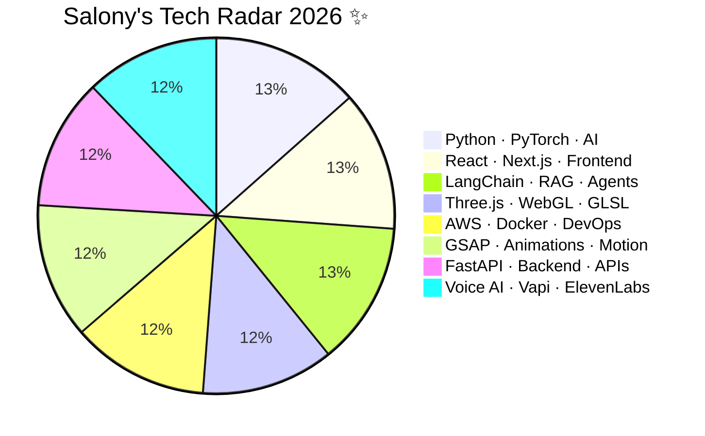

<div align="center">

<!-- Profile Image with Neon Glow Effect -->
<a href="https://vertex-flow-phi.vercel.app/">
  
</a>

<br/><br/>

<!-- Neon Rainbow Name — 4 stacked colours cycling -->


<!-- Animated Role Subtitle -->


<br/>

<!-- Status Badges Row -->

&nbsp;

&nbsp;

&nbsp;


</div>

---

<!-- ═══════════════════════════════════════════════════════════ -->
<!--                  TABLE OF CONTENTS                        -->
<!-- ═══════════════════════════════════════════════════════════ -->

## 📋 Table of Contents

1. [🌌 Live Analytics](#1--live-analytics)
2. [🧬 Agentic RAG System Intelligence](#2--agentic-rag--system-intelligence)
3. [🛠️ Tech Arsenal](#3-%EF%B8%8F-tech-arsenal)
4. [🎮 3D Immersive Previews](#4--3d-immersive-previews)
5. [🔥 Featured Projects Galaxy](#5--featured-projects-galaxy)
6. [📊 Tech Radar](#6--tech-radar)
7. [🌱 Currently Mastering](#7--currently-mastering)
8. [🐍 Neon Contribution Snake](#8--neon-contribution-snake)
9. [🏆 GitHub Trophies](#9--github-trophies)
10. [🎵 Currently Jamming](#10--currently-jamming)
11. [🤝 Let's Connect](#11--lets-connect)
12. [💫 Support the Dev](#12--support-the-dev)

---

<!-- ═══════════════════════════════════════════════════════════ -->
<!--                   1. LIVE ANALYTICS                       -->
<!-- ═══════════════════════════════════════════════════════════ -->

## 1. 🌌 Live Analytics

<div align="center">

<table border="0" cellspacing="0" cellpadding="10">
  <tr>
    <td align="center" width="50%">
      
    </td>
    <td align="center" width="50%">
      
    </td>
  </tr>
  <tr>
    <td align="center" width="50%">
      
    </td>
    <td align="center" width="50%">
      
    </td>
  </tr>
</table>

</div>

---

<!-- ═══════════════════════════════════════════════════════════ -->
<!--              2. AGENTIC RAG SYSTEM                        -->
<!-- ═══════════════════════════════════════════════════════════ -->

## 2. 🧬 Agentic RAG · System Intelligence

<div align="center">


<br/>

| ⚙️ **Pipeline Layer** | 🔬 **Technology Stack** | 📈 **Performance** | 🎯 **Capability** |
| :--- | :--- | :---: | :--- |
| 📄 **Document Ingestion** | `PageWhisper` + `Gemini 2.5 Pro` | High-Precision | Multi-format PDF/Web parsing |
| 🧠 **Reasoning Engine** | `LangChain` RAG Agents + `MCP Protocol` | Autonomous | Multi-step chain-of-thought |
| 🎙️ **Voice Synthesis** | `Vapi` + `ElevenLabs` WebRTC | < 600ms latency | Real-time voice conversations |
| 🔍 **Semantic Search** | `FAISS` + `ChromaDB` Vector Stores | Sub-50ms recall | Context-aware retrieval |
| 🚀 **Deployment** | `AWS` + `Docker` + `Vercel` | 99.9% uptime | Edge-optimized globally |

<br/>


&nbsp;

&nbsp;

&nbsp;


</div>

---

<!-- ═══════════════════════════════════════════════════════════ -->
<!--                   3. TECH ARSENAL                         -->
<!-- ═══════════════════════════════════════════════════════════ -->

## 3. 🛠️ Tech Arsenal

<div align="center">


### 🤖 AI · LLMs · Agentic Systems
<p>
  
  
  
  
  
  
  
  
</p>

### ⚛️ Frontend · 3D · Animation
<p>
  
  
  
  
  
  
  
  
</p>

### ☁️ Backend · Cloud · DevOps
<p>
  
  
  
  
  
  
  
  
</p>

<br/>

<!-- Skill Icons Row -->
<a href="https://skillicons.dev">
  
</a>

</div>

---

<!-- ═══════════════════════════════════════════════════════════ -->
<!--                4. 3D IMMERSIVE PREVIEWS                   -->
<!-- ═══════════════════════════════════════════════════════════ -->

## 4. 🎮 3D Immersive Previews

<div align="center">

<table border="0" cellspacing="10" cellpadding="15">
  <tr>
    <td align="center" width="50%">
      <a href="https://vertex-flow-phi.vercel.app/">
        
      </a>
      <br/>
      <kbd><strong>⬡ VertexFlow 3D Portfolio</strong></kbd>
      <br/><br/>
      <p>
        
        
        
      </p>
      <a href="https://vertex-flow-phi.vercel.app/">
        
      </a>
    </td>
    <td align="center" width="50%">
      <a href="https://roleradarz.streamlit.app/">
        
      </a>
      <br/>
      <kbd><strong>⬡ RoleRadar · AI Interview Coach</strong></kbd>
      <br/><br/>
      <p>
        
        
        
      </p>
      <a href="https://roleradarz.streamlit.app/">
        
      </a>
    </td>
  </tr>
</table>

</div>

---

<!-- ═══════════════════════════════════════════════════════════ -->
<!--               5. FEATURED PROJECTS GALAXY                  -->
<!-- ═══════════════════════════════════════════════════════════ -->

## 5. 🔥 Featured Projects Galaxy ✨

<div align="center">

| 🚀 | **Project** | **Description** | **Tech Stack** | **Status** | **Links** |
|:---:|:---|:---|:---|:---:|:---|
| 🎙️ | **SonicPrep AI** | AI voice interview coach with real-time RAG feedback and sub-600ms response | `Gemini 2.5` `Vapi` `LangChain` `RAG` | 🟢 Live | [](https://sonic-prep.vercel.app) [](https://github.com/salonyranjan/sonic-prep) |
| 🎮 | **VertexFlow** | Cinematic 3D portfolio with WebGL shaders, particle systems & GSAP scroll | `Three.js` `GSAP` `WebGL` `GLSL` | 🟢 Live | [](https://vertex-flow-phi.vercel.app) |
| 📄 | **PageWhisper** | Agentic document intelligence — upload any PDF, get voice-powered Q&A | `Next.js` `ElevenLabs` `RAG` `FAISS` | 🆕 SaaS | [](https://github.com/salonyranjan/PageWhisper) |
| 🏠 | **Z-Axis Cloud** | 3D cloud file manager with Puter.js and immersive spatial UI | `Puter.js` `Three.js` `3D Render` | 🏗️ Beta | [](https://github.com/salonyranjan/Z-Axis-Cloud) |
| 🎯 | **RoleRadar** | AI-powered career navigator with real-time job matching and RAG insights | `LangChain` `Streamlit` `Whisper` | 🟢 Live | [](https://roleradarz.streamlit.app) |
| 🍹 | **Mocktail** | High-end mixology showcase with GSAP cinematic animations & glassmorphism | `React` `GSAP` `Tailwind` `Vite` | 🟢 Live | [](https://mocktail-seven.vercel.app) |

</div>

---

<!-- ═══════════════════════════════════════════════════════════ -->
<!--                    6. TECH RADAR                          -->
<!-- ═══════════════════════════════════════════════════════════ -->

## 6. 📊 Tech Radar

<div align="center">



</div>

---

<!-- ═══════════════════════════════════════════════════════════ -->
<!--                 7. CURRENTLY MASTERING                    -->
<!-- ═══════════════════════════════════════════════════════════ -->

## 7. 🌱 Currently Mastering · *The Agentic Era*

<div align="center">

| 🔮 **Domain** | 📖 **Focus** | ⚡ **Project** |
|:---:|:---|:---|
| 🤖 **Agentic Workflows** | Multi-agent RAG + MCP Protocol orchestration | PageWhisper v2 |
| 🎨 **WebGL Shaders** | GLSL vertex & fragment shader cinematics | VertexFlow v2 |
| 🗣️ **Voice AI** | Sub-600ms Gemini + Vapi WebRTC pipelines | SonicPrep AI |
| ☁️ **Cloud Native** | AWS Lambda + Docker + Vercel Edge deployments | Z-Axis Cloud |
| 🧠 **LLM Fine-Tuning** | LoRA + PEFT on domain-specific datasets | Internal R&D |
| 🔐 **AI Safety** | Guardrails, prompt injection defense, red-teaming | Research |

</div>

---

<!-- ═══════════════════════════════════════════════════════════ -->
<!--               8. NEON CONTRIBUTION SNAKE                  -->
<!-- ═══════════════════════════════════════════════════════════ -->

## 8. 🐍 Neon Contribution Snake

<div align="center">

<picture>
  <source media="(prefers-color-scheme: dark)" srcset="https://raw.githubusercontent.com/salonyranjan/salonyranjan/output/github-contribution-grid-snake-dark.svg" />
  <source media="(prefers-color-scheme: light)" srcset="https://raw.githubusercontent.com/salonyranjan/salonyranjan/output/github-contribution-grid-snake.svg" />
  
</picture>

</div>

---

<!-- ═══════════════════════════════════════════════════════════ -->
<!--                  9. GITHUB TROPHIES                       -->
<!-- ═══════════════════════════════════════════════════════════ -->

## 9. 🏆 GitHub Trophies

<div align="center">


</div>

---

<!-- ═══════════════════════════════════════════════════════════ -->
<!--                  10. CURRENTLY JAMMING                    -->
<!-- ═══════════════════════════════════════════════════════════ -->

## 10. 🎵 Currently Jamming

<div align="center">


&nbsp;

&nbsp;


<br/><br/>


</div>

---

<!-- ═══════════════════════════════════════════════════════════ -->
<!--                   11. LET'S CONNECT                       -->
<!-- ═══════════════════════════════════════════════════════════ -->

## 11. 🤝 Let's Connect

<div align="center">


<br/><br/>

<a href="https://linkedin.com/in/salony-ranjan-b63200280">
  
</a>
&nbsp;&nbsp;
<a href="mailto:salonyranjan@gmail.com">
  
</a>
&nbsp;&nbsp;
<a href="https://vertex-flow-phi.vercel.app/">
  
</a>
&nbsp;&nbsp;
<a href="https://github.com/salonyranjan">
  
</a>
&nbsp;&nbsp;
<a href="https://twitter.com/salonyranjan">
  
</a>

<br/><br/>

```
💬  Open to: SDE Internships · AI Research Collabs · Open Source Projects · Freelance 3D Builds
📍  Location: Patna, Bihar, India  |  25.5941° N, 85.1376° E
⏰  Timezone: IST (UTC +5:30)  |  Usually replies within 24 hours
```

</div>

---

<!-- ═══════════════════════════════════════════════════════════ -->
<!--                  12. SUPPORT THE DEV                      -->
<!-- ═══════════════════════════════════════════════════════════ -->

## 12. 💫 Support the Dev

<div align="center">

<p>If my work sparked an idea, saved you hours, or just looked cool — consider giving a ⭐ and following! 🚀</p>

<a href="https://github.com/salonyranjan?tab=repositories">
  
</a>
&nbsp;
<a href="https://github.com/salonyranjan">
  
</a>

<br/><br/>


</div>

---

<!-- ═══════════════════════════════════════════════════════════ -->
<!--                      FOOTER                               -->
<!-- ═══════════════════════════════════════════════════════════ -->

<div align="center">


<br/>


&nbsp;

&nbsp;


<br/><br/>


<br/>

**Built with ❤️ from Earth &nbsp;|&nbsp; Salony Ranjan &nbsp;|&nbsp; `25.5941° N, 85.1376° E`**

</div>

