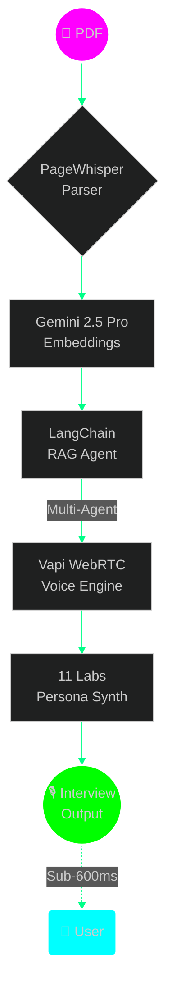
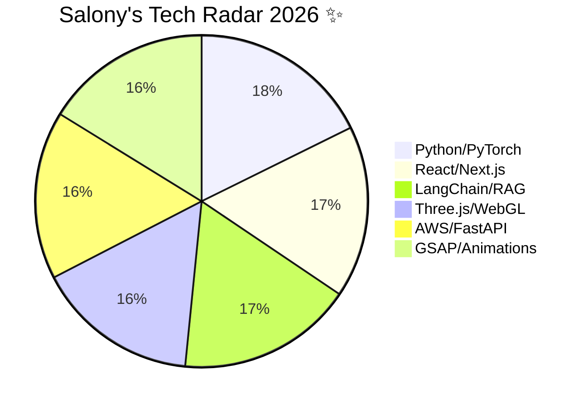

<div align="center">

# 


</div>

<p align="center">
  
</p>

## 🌌 Live Analytics (Neon Cyberpunk Edition)

<div align="center">

[](https://github.com/anuraghazra/github-readme-stats)

[](https://github.com/anuraghazra/github-readme-stats)

[](https://github.com/DenverCoder1/github-readme-streak-stats)

</div>

## 🧬 Agentic RAG Architecture (Interactive Flow)



## 🎮 3D Immersive Previews

<div align="center">

<!-- VertexFlow 3D Cube -->
<svg width="120" height="120" viewBox="0 0 120 120" xmlns="http://www.w3.org/2000/svg">
  <defs>
    <filter id="neon-glow" x="-50%" y="-50%" width="200%" height="200%">
      <feGaussianBlur stdDeviation="3" result="coloredBlur"/>
      <feMerge> 
        <feMergeNode in="coloredBlur"/>
        <feMergeNode in="SourceGraphic"/>
      </feMerge>
    </filter>
    <linearGradient id="cubeGrad" x1="0%" y1="0%" x2="100%" y2="100%">
      <stop offset="0%" stop-color="#00ffff"/>
      <stop offset="50%" stop-color="#ff00ff"/>
      <stop offset="100%" stop-color="#00ff88"/>
    </linearGradient>
  </defs>
  <g transform="rotate(45 60 60)" filter="url(#neon-glow)">
    <!-- Cube faces -->
    <path d="M30 30 L90 30 L75 15 Z" fill="url(#cubeGrad)" opacity="0.8"/>
    <path d="M30 30 L75 15 L75 45 Z" fill="#ff00ff" opacity="0.6"/>
    <path d="M90 30 L75 15 L75 45 Z" fill="#00ff88" opacity="0.7"/>
    <!-- Rotation animation -->
    <animateTransform attributeName="transform" type="rotate" values="0 60 60; 360 60 60" dur="20s" repeatCount="indefinite"/>
  </g>
  <text x="60" y="105" text-anchor="middle" fill="#00ffff" font-family="monospace" font-size="10" font-weight="bold" filter="url(#neon-glow)">VertexFlow</text>
</svg>

<!-- PageWhisper Hologram -->
<svg width="120" height="120" viewBox="0 0 120 120">
  <circle cx="60" cy="60" r="50" fill="none" stroke="#00ffff" stroke-width="2" filter="url(#neon-glow)">
    <animate attributeName="r" values="50;55;50" dur="3s" repeatCount="indefinite"/>
  </circle>
  <text x="60" y="65" text-anchor="middle" fill="#ff00ff" font-family="monospace" font-size="12" font-weight="bold">PageWhisper</text>
</svg>

</div>

## 🔥 Featured Projects Galaxy ✨

| Project | Tech Stack | Status | Links |
|---------|------------|--------|-------|
| 🎙️ **SonicPrep AI** | Gemini 2.5 Pro + Vapi + RAG | 🚀 Live | [](https://sonic-prep.vercel.app) [](https://github.com/salonyranjan/sonic-prep) |
| 🎮 **VertexFlow** | Three.js + GSAP + WebGL | 🎥 3D Live | [](https://vertex-flow-phi.vercel.app) |
| 📄 **PageWhisper** | Next.js + 11 Labs + RAG | 🆕 SaaS | [](https://github.com/salonyranjan/PageWhisper) |
| 🏠 **Z-Axis Cloud** | Puter.js + 3D Render | 🏗️ Building | [](https://github.com/salonyranjan/Z-Axis-Cloud) |

## 🐍 Neon Contribution Snake Animation

<div align="center">
  <picture>
    <source media="(prefers-color-scheme: dark)" srcset="https://raw.githubusercontent.com/salonyranjan/salonyranjan/output/github-contribution-grid-snake-dark.svg">
    
  </picture>
</div>

## 🎵 Currently Jamming (Spotify Widget)
<!-- Replace YOUR_SPOTIFY_ID with your actual Spotify ID -->
<span></span>

## 🛠️ Tech Radar (Live Scores)



## 🌱 Currently Mastering (Agentic Era)

```markdown
- 🔮 **Agentic Workflows** → Multi-agent RAG + MCP Protocol
- 🎨 **WebGL Shaders** → VertexFlow cinematic experiences  
- 🗣️ **Voice AI** → Sub-600ms Gemini + Vapi WebRTC
- ☁️ **Cloud Native** → AWS + Docker + Vercel deployments
```

## 🔗 Neural Network → Connect

<div align="center">
  <a href="https://linkedin.com/in/salony-ranjan-b63200280">
    
  </a>
  <a href="https://vertex-flow-phi.vercel.app">
    
  </a>
  <a href="mailto:salonyranjan@example.com">
    
  </a>
</div>

## 💫 Support the Cyberpunk Dev

[](https://buymeacoffee.com/salonyranjan)
[](https://github.com/sponsors/salonyranjan)

---

<div align="center">
 
  <br><br>
  <span style="color: #00ffff; font-weight: bold;">Built with ❤️ from Patna, Bihar | NSEC 2026 🚀</span>
</div>
