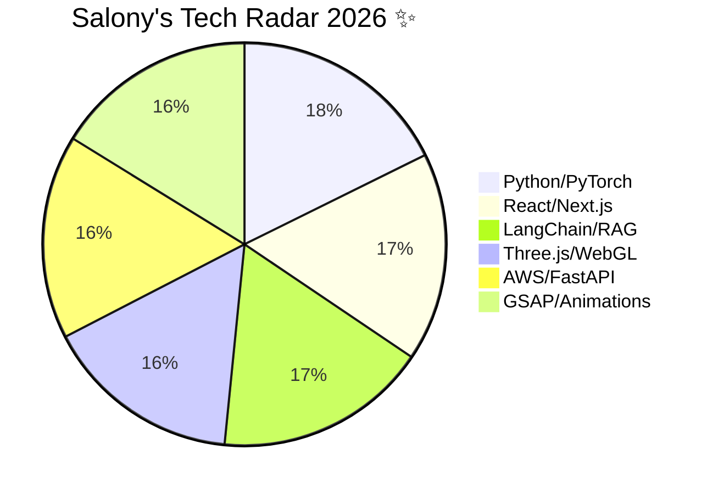

<div align="center">

# 


<br />

<p align="center">
  <a href="https://skillicons.dev">
    
  </a>
</p>


</div>

## 🌌 Live Analytics

<div align="center">

[](https://github.com/anuraghazra/github-readme-stats)

[](https://github.com/anuraghazra/github-readme-stats)

[](https://github.com/DenverCoder1/github-readme-streak-stats)

</div>

## 🧬 Agentic RAG : System Intelligence

<div align="center">
  
</div>

<div align="center">

| **Core Pipeline** | **Technology Stack** | **Performance** |
| :--- | :--- | :--- |
| 📄 **Ingestion** | `PageWhisper` + `Gemini 2.5` | High-Precision |
| 🧠 **Intelligence** | `LangChain` RAG Agents | Autonomous |
| 🎙️ **Synthesis** | `Vapi` + `ElevenLabs` | Sub-600ms |
| 🚀 **Deployment** | `AWS` + `Docker` | Production |

</div>

<p align="center">
  
  
  
</p>

---


## 🎮 3D Immersive Previews

<div align="center">
  <table border="0">
    <tr>
      <td align="center">
        <kbd><b>VertexFlow</b></kbd><br />
        <a href="https://vertex-flow-phi.vercel.app/">
          
        </a><br />
        <code>Three.js • GSAP</code>
      </td>
      <td align="center">
        <kbd><b>RoleRadar</b></kbd><br />
        <a href="https://roleradarz.streamlit.app/">
          
        </a><br />
        <code>LangChain • RAG</code>
      </td>
    </tr>
  </table>
</div>

---


## 🔥 Featured Projects Galaxy ✨

| Project | Tech Stack | Status | Links |
|---------|------------|--------|-------|
| 🎙️ **SonicPrep AI** | Gemini 2.5 Pro + Vapi + RAG | 🚀 Live | [](https://sonic-prep.vercel.app) [](https://github.com/salonyranjan/sonic-prep) |
| 🎮 **VertexFlow** | Three.js + GSAP + WebGL | 🎥 3D Live | [](https://vertex-flow-phi.vercel.app) |
| 📄 **PageWhisper** | Next.js + 11 Labs + RAG | 🆕 SaaS | [](https://github.com/salonyranjan/PageWhisper) |
| 🏠 **Z-Axis Cloud** | Puter.js + 3D Render | 🏗️ Building | [](https://github.com/salonyranjan/Z-Axis-Cloud) |

## 🐍 Neon Contribution Snake Animation

<div align="center">
  <picture>
    <source media="(prefers-color-scheme: dark)" srcset="https://raw.githubusercontent.com/salonyranjan/salonyranjan/output/github-contribution-grid-snake-dark.svg">
    
  </picture>
</div>


## 🎵 Currently Jamming

<p align="center">
  
  
  
</p>

<div align="center">
  
</div>


## 🛠️ Tech Radar (Live Scores)




## 🌱 Currently Mastering (Agentic Era)

```markdown
- 🔮 **Agentic Workflows** → Multi-agent RAG + MCP Protocol
- 🎨 **WebGL Shaders** → VertexFlow cinematic experiences  
- 🗣️ **Voice AI** → Sub-600ms Gemini + Vapi WebRTC
- ☁️ **Cloud Native** → AWS + Docker + Vercel deployments
```

## 🤝 Let's Connect

<p align="center">
  <a href="linkedin.com/in/salony-ranjan-b63200280">
    
  </a>&nbsp;&nbsp;
  <a href="mailto:salonyranjan@gmail.com">
    
  </a>&nbsp;&nbsp;
  <a href="https://vertex-flow-phi.vercel.app/">
    
  </a>
</p>

<div align="center">
  
</div>


## 💫 Support the Dev

<div align="center">
  <p>If you find my work helpful, consider fueling the next breakthrough! 🚀</p>

  <a href="upi://pay?pa=salnyranjan-1@okhdfcbank&pn=Salony%20Ranjan&cu=INR">
    
  </a>

  <br />
  <br />

  <kbd>
    
  </kbd>

  <br />
  
  
</div>

<br />

<div align="center">
  
   <br />
  
    <br /><br />
 <code style="color: #00ffff; font-weight: bold;"> Built with ❤️ from Earth | Salony Ranjan | 25.5941° N, 85.1376° E </code>
   <br />
  
  
</div>
